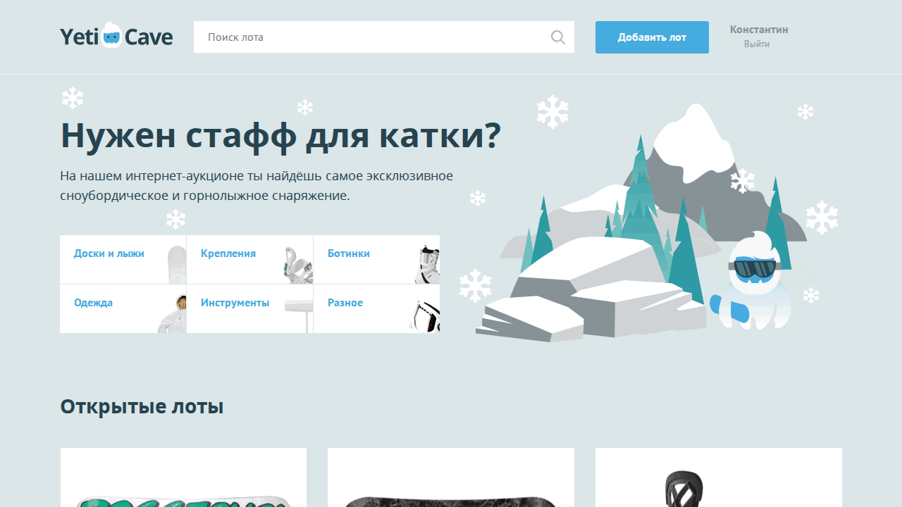

# 1notlov3_yeticave

Учебный PHP-проект в стиле аукциона/маркетплейса (Yeticave).

## Overview

Проект содержит фронтенд и серверные PHP-страницы для лотов, авторизации и пользовательских сценариев. Полный функционал зависит от MySQL-базы.

## Demo



Демо выше снято с текущего фронтенда (`index.html`) в локальном запуске.

## Features

- Главная страница с лотами и категориями
- Страницы логина/регистрации/добавления лота
- PHP-шаблоны и утилиты в `core/`
- Подготовка под работу с MySQL через PDO

## Stack

- PHP
- MySQL (по конфигу)
- HTML/CSS
- JavaScript

## Setup

### Быстрый просмотр фронтенда

```bash
python3 -m http.server 4102
```

Open: `http://localhost:4102/index.html`

### Полный PHP-режим

1. Поднять PHP + MySQL
2. Заполнить `core/config.php`
3. Запустить локальный PHP сервер:

```bash
php -S localhost:8080
```

## Usage

- Для витрины: открыть `index.html`
- Для полной логики: запускать `.php` страницы через PHP сервер и подключенную БД
